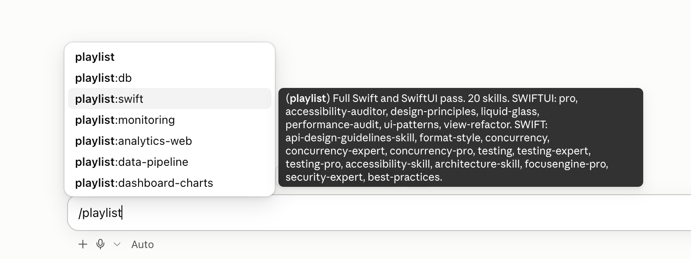
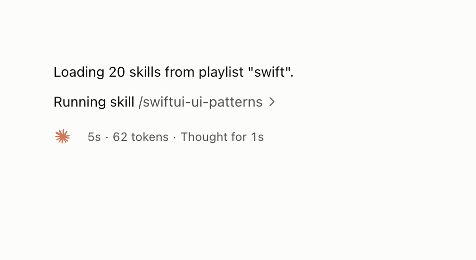

# Playlist

Skill playlists for Claude Code. Group any of your installed skills under one name, then load them all from the slash menu.

Type `/playlist` and the menu shows the tool, then every playlist you have. Hover over one to see what is in it:



Pick one and add your request:

```
/playlist:swift review LoginView before I commit
```

Claude says how many skills it is loading, loads every one in parallel, confirms `▶ swift · 20/20 skills loaded`, and carries on with your request:



## Why

Claude Code has no saved group of skills. Typing `/a /b /c` stacks six at most and nothing is remembered, so people paste the same "load these 20 skills" list over and over. A playlist is that list, saved once and one tab away.

## Install

```
d=$(mktemp -d) && git clone --depth 1 https://github.com/mvoshell652/playlist "$d" && sh "$d/install.sh"
```

Then start a new Claude Code session and type `/playlist`.

The script copies the tool into `~/.claude/skills/playlist/`. It needs Python 3.8 or newer on PATH as `python3`, `python` or `py`, and nothing else. It works in the terminal, the desktop app and the IDE extensions, because they share that folder.

**Update:** run the same line again. Your playlists are never touched.

**Uninstall:** delete the folder. This also deletes your playlists, so copy `skills/` out first if you want to keep them.

```
rm -rf ~/.claude/skills/playlist
```

### Why this is not a `/plugin install`

Claude Code copies a marketplace plugin into a versioned cache folder and replaces that folder on every update. Your playlists live inside the tool's folder, because that is what makes them show up as `/playlist:<name>`, so a marketplace update would delete them. A marketplace plugin also cannot register a bare command: installed that way, `/playlist` itself disappears and only `/playlist:<name>` remains.

A plugin that sits in your skills directory is loaded in place, keeps its files, and gets both the bare command and the namespaced ones. That is a documented Claude Code feature ([skills-directory plugins](https://code.claude.com/docs/en/plugins-reference#skills-directory-plugins)), and it is the only layout that does everything this tool needs.

## Create and edit playlists

Run `/playlist` with nothing after it. It walks you through a short menu using Claude's own question panel, so you pick instead of type:

1. **What do you want to do?** Create a playlist, edit one, delete one, or see your playlists.
2. **What should we call it?** A few suggested names, or type your own.
3. **Which skills do you want in it?** You never search one word at a time:
   - **Type them all on one line.** Names, partial names or a description: `nuxt vue pinia shadcn vitest a11y`, or "everything for a Nuxt app with Pinia and testing". Claude resolves every word in one pass.
   - **Suggest for this project.** Claude reads the project's dependency files and proposes the installed skills that fit the stack.
   - **From this conversation**, or **from your history** of skills you often load together.
4. **Review one list.** Claude shows what it gathered, marks the places where it chose between similar skills so you can swap them, and asks only about genuine toss-ups. Create it, add more, or remove some.

Editing offers add skills, remove skills, rename and change description. Deleting always asks first, and never touches the skills themselves.

If you already know what you want, say it and the menu skips ahead:

```
/playlist new nuxt-app with nuxt vue pinia shadcn vitest a11y
/playlist add swiftdata to swift
/playlist delete review
```

Adding or removing a skill takes effect in the current session. When you create a playlist, the menu ends by offering to **play it now**, which loads its skills into the conversation straight away. To see a new or renamed playlist in the `/` menu without waiting for your next session, type `/reload-plugins`; Claude Code reserves that command for you, so the tool cannot run it on your behalf.

## How it works

The tool is a plugin that lives in your skills directory. Claude Code registers such a plugin's root skill under its bare name and the skills inside it as `name:skill`, which is what puts the menu at `/playlist` and each playlist at `/playlist:<name>`:

```
~/.claude/skills/playlist/
  .claude-plugin/plugin.json
  SKILL.md                       /playlist, the guided menu
  bin/                           the CLI the menu calls
  skills/swift/playlist.json     a playlist
  skills/swift/SKILL.md          /playlist:swift, generated from it
```

```json
{
  "name": "swift",
  "description": "Full Swift and SwiftUI pass",
  "mode": "all",
  "auto_when": "",
  "skills": ["swiftui-pro", "swift-concurrency", "supabase:supabase"]
}
```

A generated `SKILL.md` is static text that tells Claude which skills to load. Playing a playlist runs no command and needs no permission.

- `mode: all` loads every skill. `mode: pick` lists each skill with its description and lets Claude load only what the request needs, which suits very large playlists.
- A playlist only plays when you call it. You can let Claude load one on its own by giving it a rule such as "working on Swift code".
- A playlist does not make skills cheaper. Loading 20 skills costs the same context either way; `pick` is the only mode that loads less.

### Share with a team (experimental)

Ask `/playlist` to share a playlist with your team and it writes the playlist to `<repo>/.claude/skills/playlist/`, which you can commit. Claude Code loads a plugin from a project's skills folder only after the workspace trust prompt, and only from the folder the session starts in. Running a personal and a project copy of the `playlist` plugin side by side has not been tested yet, so treat this as a preview.

### Safety

Project playlists are committed and shared, so every `playlist.json` is treated as untrusted. Only entries shaped like a skill id reach a generated skill; everything else is dropped and `doctor` reports the count. Names come from the folder, descriptions are flattened to one short line, and text you type into the menu is reduced to an allow-list of characters before it goes near a command.

## Develop

```
python3 -m unittest discover -s tests -v
sh bin/playlist --help
```

`PLAYLISTS_HOME` and `CLAUDE_CONFIG_DIR` redirect where playlists and skills are looked up, which keeps experiments away from your real `~/.claude`.

## License

MIT. See [LICENSE](LICENSE).
